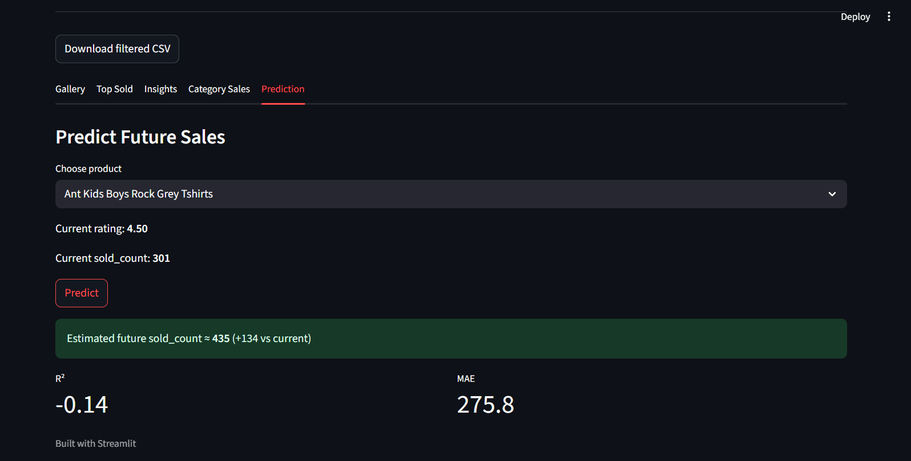
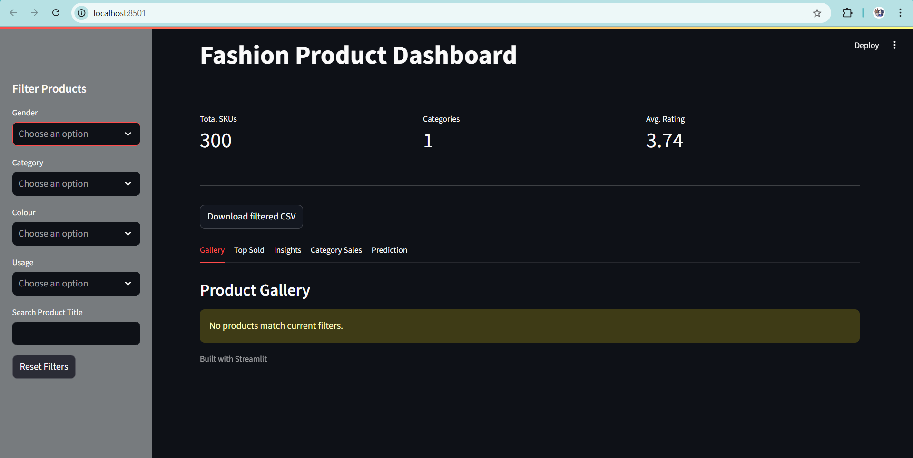
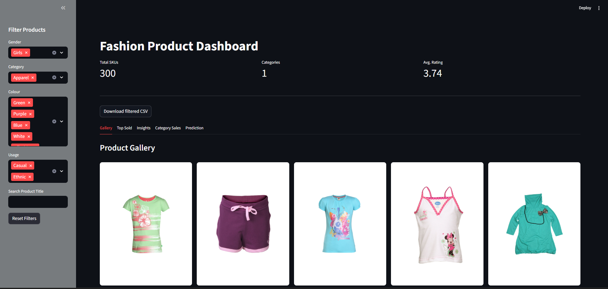
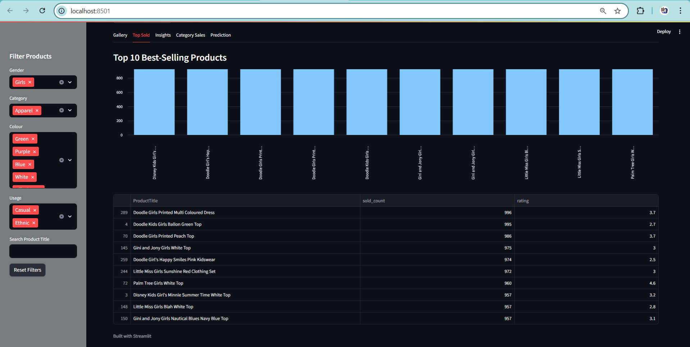
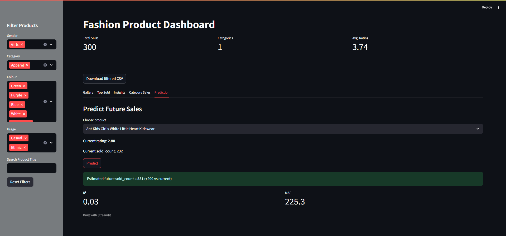
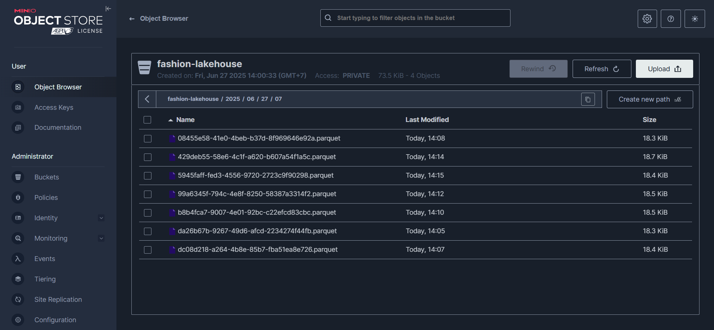

# Final Project: Big Data dan Data Lakehouse - Kelompok B6

## Anggota Kelompok

| NRP        | Nama Lengkap              |
| ---------- | ------------------------- |
| 5027221038 | Dani Wahyu Anak Ary       |
| 5027221048 | Malvin Putra Rismahardian |
| 5027221084 | Farand Febriansyah        |
| 5027221088 | Veri Rahman               |

# Analisis Penjualan Fashion: Prediksi Penjualan Produk

## Deskripsi Masalah

Penjualan produk fashion sangat dipengaruhi oleh banyak faktor seperti rating pelanggan, popularitas, harga, dan kategori produk. Proyek ini bertujuan membangun sistem data lakehouse real-time untuk menampilkan visualisasi data produk sekaligus melakukan prediksi jumlah penjualan berikutnya menggunakan model machine learning berbasis regresi.

## Tujuan Proyek

- Membangun pipeline real-time dengan Kafka dan MinIO untuk menyimpan data produk fashion

- Membuat proses ETL dari Kafka Producer ke MinIO

- Melatih model regresi untuk memprediksi jumlah penjualan

- Menyediakan dashboard interaktif menggunakan Streamlit

## Overview

Proyek ini membangun sistem _Data Lakehouse Real-Time_ untuk data penjualan produk fashion menggunakan pipeline yang terdiri dari Kafka, Python, MinIO, dan Streamlit.

Sistem ini menyediakan:

- Streaming data real-time dari CSV ke Kafka.
- Konsumsi Kafka dan simpan ke MinIO dalam format Parquet.
- Dashboard interaktif untuk eksplorasi data dan prediksi jumlah penjualan berdasarkan rating dan penjualan saat ini.

## Dataset

[https://www.kaggle.com/datasets/vikashrajluhaniwal/fashion-images](https://www.kaggle.com/datasets/vikashrajluhaniwal/fashion-images)

## Arsitektur

Sistem ini mengikuti arsitektur real-time lakehouse yang terdiri dari:

- Dataset CSV → Kafka → Kafka Consumer → MinIO → Streamlit
- Model prediksi sederhana menggunakan Linear Regression
- Data tersimpan dalam format Parquet di bucket `fashion-lakehouse` MinIO


## How to run?

### Quick start

```bash
bash start.sh
```

Script ini akan:

- Build dan start container
- Membuat bucket MinIO jika belum ada
- Menjalankan producer dan processor
- Membuka dashboard di [http://localhost:8501](http://localhost:8501)

### Manual Steps

1. _Start Docker Compose_

```bash
docker-compose up -d --build
```

2. _Pastikan bucket MinIO tersedia_

```bash
docker-compose exec minio sh -c '
  mc alias set local http://localhost:9000 minioadmin minioadmin
  mc mb --ignore-existing local/fashion-lakehouse
'
```

3. _Jalankan producer real-time_

```bash
docker-compose exec streamlit \
  python kafka/producer_rt.py \
    --csv-path data/fashion_sales.csv \
    --interval 1 \
    --bootstrap-servers kafka:9092
```

4. _Dashboard_ akan tersedia di:

[http://localhost:8501](http://localhost:8501)

## Folder Struktur

```
.
├── start.sh
├── docker-compose.yml
├── Dockerfile.processor
├── requirements.txt
├── data/
│   └── fashion_sales.csv
├── kafka/
│   └── producer_rt.py
├── processor/
│   └── python_processor.py
├── streamlit_app/
│   ├── app.py
│   └── predictor.py
├── img/
│   └── Group_739.png
```

## Dashboard Fitur

| Tab        | Deskripsi                                                                         |
| ---------- | --------------------------------------------------------------------------------- |
| Gallery    | Menampilkan produk berdasarkan filter                                             |
| Top Sold   | Menampilkan 10 produk dengan penjualan tertinggi                                  |
| Insights   | Donut chart distribusi kategori & heatmap rating                                  |
| Prediction | Memasukkan nama produk dan sold_count saat ini untuk prediksi sold_count ke depan |

Contoh prediksi:

- Input: Ant Kids Boys Rock Grey Tshirts sold_count: 301, rating: 4.50
- Output: predicted sold_count: 435


## Output Screenshots
- _Dashboard UI_

  

Deskripsi:

Ini adalah tampilan utama dashboard setelah data berhasil dimuat dari MinIO.

Di bagian atas terdapat KPI seperti:

Total SKUs: jumlah total produk fashion yang tersedia.

Categories: jumlah kategori produk unik.

Avg. Rating: rata-rata penilaian dari semua produk.

Terdapat tombol Download filtered CSV untuk mengunduh data yang telah difilter.

Navigasi tab tersedia untuk menjelajahi fitur seperti Gallery, Top Sold, Insights, Category Sales, dan Prediction.

- _Gallery Product_



Deskripsi:

Menampilkan gambar-gambar produk dari dataset berdasarkan filter yang dipilih.

Setiap produk ditampilkan dengan gambar dan judul produk.

Disusun secara grid otomatis menggunakan Streamlit columns() dan CSS hover untuk efek pembesaran.

Berguna untuk melihat visual produk fashion berdasarkan gender, warna, kategori, dan lainnya.

- _Top Sold Products_

  

Deskripsi:

Menampilkan 10 produk dengan penjualan tertinggi berdasarkan nilai sold_count.

Disajikan dalam bentuk bar chart dan dataframe untuk mempermudah perbandingan.

Chart menunjukkan visual penjualan, sedangkan tabel memberikan rincian nama produk, jumlah terjual, dan rating.

- _Prediction Feature_

  

Deskripsi:

Fitur prediksi penjualan produk di masa depan menggunakan model Linear Regression.

User memilih produk, memasukkan nilai sold_count saat ini.

Sistem secara otomatis menampilkan rating produk tersebut.

Setelah klik tombol Predict, akan muncul prediksi penjualan berikutnya beserta:

Perbedaan nilai prediksi dengan penjualan saat ini.

Nilai akurasi model (R²) dan Mean Absolute Error (MAE).

Berguna untuk mengestimasi performa produk ke depannya.

- _MinIO Dashboard_

 

## Catatan

- Dashboard menggunakan model LinearRegression untuk prediksi.
- Data disimpan sebagai file .parquet di MinIO.
- Jika ingin mengubah model, edit kode pada tab "Prediction" di streamlit_app/app.py.
